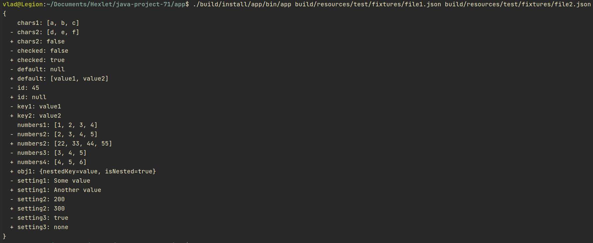

### Hexlet tests and linter status:
[](https://github.com/Zenjo93/java-project-71/actions)
[](https://github.com/Zenjo93/java-project-71/actions/workflows/main.yml)
[](https://codeclimate.com/github/Zenjo93/java-project-71/maintainability)
[](https://codeclimate.com/github/Zenjo93/java-project-71/test_coverage)
# Hexlet Project #2: "Diff Generator"

## How to install
For installing: clone repo to your computer and run ```make run-dist``` from /app directory

## Description
You can use program like CLI utility via ```./build/install/app/bin/app``` command in terminal or like import package: 
``` java
import hexlet.code.Differ;

var diff = Differ.generate(filePath1, filePath2);
System.out.println(diff);
```

### For help<br>
Type `make help` or `./build/install/app/bin/app -h`<br>
<details>
<summary>Example:</summary>


</details>

### Stylish format
For stylish format output type: ```./build/install/app/bin/app -f stylish <file1> <file2>``` <br>
Also stylish format is  using by default <br>
<details>
<summary>Example:</summary>


</details>

### Plain format
For plain format output type: ```./build/install/app/bin/app -f plain <file1> <file2>``` <br>
<details>
<summary>Example:</summary>


</details>


### Json format
For json format output type: ```./build/install/app/bin/app -f json <file1> <file2>``` <br>
<details>
<summary>Example:</summary>


</details>
